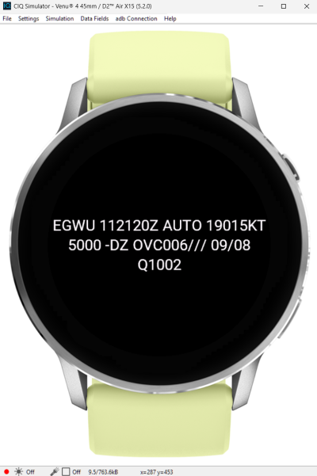

# Garmin METAR App

A Connect IQ app for Garmin watches that displays real-time METAR weather data, using the [AVWX API](https://avwx.rest).

> **Note**: This app is experimental, built as quickly as possible for personal use.

## Features
- **Real-time Weather**: Fetches raw METAR strings.
- **Station Selection**: Select from a list of airports (e.g., JFK, LHR) via the on-watch menu.
  - Stations are configured via App Settings.

Example output from simulator (and on watch when installed):

## Development notes

### Prerequisites
- [VS Code](https://code.visualstudio.com/)
- [Monkey C Extension](https://marketplace.visualstudio.com/items?itemName=garmin.monkey-c)
- [Connect IQ SDK Manager](https://developer.garmin.com/connect-iq/sdk/)
- AVWX API Token (Free tier available at [avwx.rest](https://avwx.rest))

### Setup
1.  **Clone the repository**.
2.  **Configure Settings**:
    - The API Token, Default Station, and Station List are now configured via **App Settings**.
    - **In Simulator**: Go to **File > Edit Persistent Storage > Edit Application.Properties data**
    - **Note**: Paste your AVWX API Token into the field labeled **"AvwxToken"** and click **Save** to apply.
    - **On Device**: Use the Garmin Connect App or Garmin Express.

### Running locally
1.  Open the project in VS Code.
2.  Go to **Run and Debug** (`Ctrl+Shift+D`).
3.  Select **"Simulate App"** and press Play.
4.  **Important**: In the Simulator, go to **Settings > Connection Type** and ensure **WiFi** is checked/connected to enable web requests.

### Running Tests
1.  In VS Code, open the **Command Palette** (`Ctrl+Shift+P`).
2.  Select **Monkey C: Run Tests**.
3.  Alternatively, created a **Run Configuration** in `launch.json` or select **"Run Tests"** in the Run and Debug sidebar.

## Deploying to Device (Side-Loading)
To install this app on your physical Garmin watch without publishing to the store:
1.  **Connect your watch** to your computer via USB.
2.  In VS Code, run **Monkey C: Build for Device**.
    - Select or make a new folder to build into: `./bin/`.
    - Choose `Release` build.
    - Select your device model (e.g., `venu445`).
    - This creates a `.prg` file in the `bin/` folder (e.g., `bin/garminmetar.prg`).
3.  **Copy the file**:
    - Open your watch's file system (it appears as a USB drive).
    - Navigate to the `GARMIN/APPS` folder.
    - Drag and drop `bin/garminmetar.prg` into `GARMIN/APPS`.
4.  **Disconnect** the watch.
5.  On the watch, long-press the screen, select **Watch Face**, and scroll to find "Garmin Metar".
6.  To configure settings, use the **Garmin Connect App** on your phone (tap the device > Activities, Apps & More > Watch Faces > Garmin Metar > Settings).
7.  Add your AVWX API key to the app settings.

### Note on Settings for Side-Loaded Apps
The "Settings" menu will **NOT** appear in the Garmin Connect app for side-loaded (`.prg`) files because the app is not in the store database. To configure settings:

1.  **Store Beta (Official)**: Upload as a "Beta App" to the Connect IQ Store. This is the only way to get the real UI on your phone.
2.  **Hardcode Defaults (Quickest)**: Edit `resources/settings/properties.xml` to set your API Key directly in the source code, then rebuild/copy.
3.  **Manual File (Advanced)**: Generate a `.SET` file using the Simulator ("App Settings Editor" > "Send Settings"), find the temp file, rename it to match your PRG (e.g. `garminmetar.SET`), and copy it to `GARMIN/APPS/SETTINGS` on the watch.

## Exporting for the Store (.iq)
To upload to the Connect IQ Store (or to use the Beta App feature for settings), you need a signed `.iq` file, not a `.prg`.

### Step 1: Create a Developer Key
You cannot build a store-ready file without a digital signature.
1.  In VS Code, open the **Command Palette** (`Ctrl+Shift+P`).
2.  Type `Monkey C: Generate a Developer Key`.
3.  Save it in a safe folder (e.g., `Documents/Garmin`).
    - **Important**: Do not lose this file! You need it to update the app later.

### Step 2: Export the Project
1.  Open the **Command Palette** (`Ctrl+Shift+P`).
2.  Type `Monkey C: Export Project`.
3.  Choose your developer key and a destination for the `.iq` file.
4.  VS Code will compile the app for all devices in `manifest.xml`.

### Step 3: Find and Upload
1.  Go to the [Garmin Developer Dashboard](https://apps.garmin.com/developer/dashboard).
2.  Click **Submit an App**.
3.  Upload the generated `.iq` file.
4.  **Tip**: Check **"This is a Beta App"** to keep it private while testing features like App Settings on your phone.
