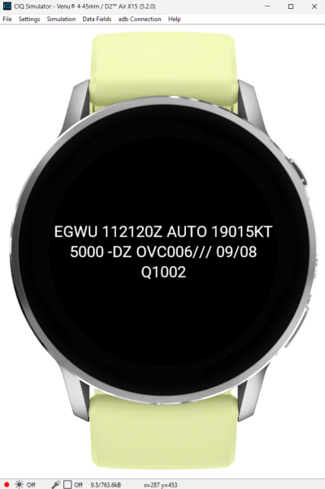

# Garmin METAR App

A Connect IQ app for Garmin watches that displays real-time METAR weather data, using the [AVWX API](https://avwx.rest).

> **Note**: This app is experimental, built as quickly as possible for personal use.

See on the [Garmin app store](https://apps.garmin.com/apps/2261817c-e073-4450-962f-10f5fa11840d).

## Features
- **Real-time Weather**: Fetches raw METAR strings and TAF forecast data.
- **Toggle METAR / TAF**: Switch between current METAR and TAF forecast via Start button or horizontal swipe.
- **Station Selection**: Select from a list of airports via on-watch menu.
  - Stations are configured via App Settings.
- **Works Out-of-the-Box**: Includes a shared public demo token for immediate use upon install.
- **Optional Personal Token**: Configure your own free token from [avwx.rest](https://avwx.rest) to bypass shared public rate limits.

## Controls & Navigation

### 5-Button Watches (Instinct, Fenix, Forerunner)
- **Toggle METAR / TAF**: Press **START / GPS** (top-right button).
- **Open Station Menu**: Press and hold **MENU** (middle-left button, ~1 sec).
  - In Simulator: Right-click MENU, click-and-hold for ~1 sec, or press **`M`** on keyboard.
  - In Menu: Select **Nearby Airports** to discover the 5 nearest reporting airfields via GPS, or choose from configured stations.
  - Use **UP / DOWN** buttons to highlight, **START** to select, **BACK** to cancel.
- **Scroll Report Text**: Press **UP** (middle-left short click) or **DOWN** (bottom-left button).
- **Exit App**: Press **BACK / SET** (bottom-right button).

### Touchscreen Watches (Venu, Vivoactive)
- **Toggle METAR / TAF**: Swipe left/right OR press the top button.
- **Open Station Menu**: Tap the touchscreen OR press and hold the bottom button.
  - Select **Nearby Airports** for 5 nearest GPS-located airfields, or pick from your saved stations.
- **Scroll Report Text**: Drag vertically or swipe up/down.

Example output from simulator (and on watch when installed):



## Development notes

### Prerequisites
- [VS Code](https://code.visualstudio.com/)
- [Monkey C Extension](https://marketplace.visualstudio.com/items?itemName=garmin.monkey-c)
- [Connect IQ SDK Manager](https://developer.garmin.com/connect-iq/sdk/)
- Optional: Personal AVWX API Token (Free tier available at [avwx.rest](https://avwx.rest))

### Setup & Configuration
1.  **Clone the repository**.
2.  **Out-of-the-Box Public Demo Token**:
    - The app works immediately without configuration using a shared public demo token.
    - When using the public token, a brief 2-second notice is displayed on launch.
    - If a user-configured token ever fails authentication (HTTP 401), the app automatically falls back to the public demo token.
3.  **Personal API Token (Optional, Recommended)**:
    - Because the public demo token is shared across all users, it may encounter rate limits during peak usage.
    - You can create your own free personal API token at [avwx.rest](https://avwx.rest) to avoid shared rate limits.
    - **In Simulator**: Go to **File > Edit Persistent Storage > Edit Application.Properties data**, enter your token in **"AvwxToken"**, and click **Save**.
    - **On Device**: Open the Garmin Connect mobile app or Garmin Express, go to app settings for Garmin METAR, and enter your token in **"AvwxToken"**.

### Running locally
1.  Open the project in VS Code.
2.  Go to **Run and Debug** (`Ctrl+Shift+D`).
  - A developer key may be needed, at the path `./developer_key`
3.  Select **"Simulate App"** and press Play.
4.  **Important**: In the Simulator, go to **Settings > Connection Type** and ensure **WiFi** is checked/connected to enable web requests.


### Running Tests
1.  In VS Code, open the **Command Palette** (`Ctrl+Shift+P`).
2.  Select **Monkey C: Run Tests**.
3.  Alternatively, created a **Run Configuration** in `launch.json` or select **"Run Tests"** in the Run and Debug sidebar.

## Deploying to Device (Side-Loading)

To test a development build on your physical Garmin watch without publishing to the store:

### 1. Avoid Store App ID Conflicts
If you have already installed Garmin METAR from the Connect IQ Store, the watch firmware will reject or silently remove a sideloaded `.prg` that shares the same App ID.
To install a dev build alongside the store version:
- Change the `id` attribute in `manifest.xml` to a new unique UUID (e.g. generate one via PowerShell: `[guid]::NewGuid().ToString()`).
- Optionally change `AppName` in `resources/strings/strings.xml` to `GarminMetar Dev` to easily distinguish it on the watch.

### 2. Configure Settings & API Token
Sideloaded (`.prg`) apps do **not** support settings configuration via the Garmin Connect mobile app (phone settings only work for Store-installed apps).
- Sideloaded apps load defaults directly from `resources/settings/properties.xml`.
- For testing with live data, set your AVWX token locally in `resources/settings/properties.xml` under `AvwxToken` before compiling.
- **IMPORTANT**: Never commit your personal API token to git. Revert temporary changes to `manifest.xml`, `strings.xml`, and `properties.xml` after building.

### 3. Build the PRG
Run the build script with your watch device ID:
```bash
uv run scripts/dev.py build --device <device_id> --output bin/garminmetardev.prg
```
*(Common device IDs: `venu445mm`, `instinct345mm`, `fenix847mm`).*

Alternatively, in VS Code: run **Monkey C: Build for Device**, select your device model, and output to `bin/`.

### 4. Copy to Watch (USB / MTP)
1. Connect your watch to your computer via USB.
2. On Windows, modern Garmin devices connect via MTP (Media Transfer Protocol) rather than a drive letter:
   - Navigate to: `This PC\<Your Watch Model>\Internal Storage\GARMIN\Apps`
   *(On USB Mass Storage models: `<Drive Letter>:\GARMIN\APPS`)*
3. Copy `bin/garminmetardev.prg` into the `Apps` directory.

### 5. Disconnect and Launch
- Garmin watches stay in USB storage/charging mode while plugged in. **Unplug the USB cable** to trigger the watch to install the new binary and return to the main interface.
- Open the watch's Activities & Apps list to launch **GarminMetar Dev**.

## Exporting for the Store (.iq)
To upload to the Connect IQ Store (or to use the Beta App feature for settings), you need a signed `.iq` file, not a `.prg`.

### Step 1: Create a Developer Key
You cannot build a store-ready file without a digital signature.
1.  In VS Code, open the **Command Palette** (`Ctrl+Shift+P`).
2.  Type `Monkey C: Generate a Developer Key`.
3.  Save it in a safe folder (e.g., `Documents/Garmin`).
    - **Important**: Do not lose this file! You need it to update the app later.

### Step 2: Export the Project
1.  Open the **Command Palette** (`Ctrl+Shift+P`).
2.  Type `Monkey C: Export Project`.
3.  Choose your developer key and a destination for the `.iq` file.
4.  VS Code will compile the app for all devices in `manifest.xml`.

### Step 3: Find and Upload
1.  Go to the [Garmin Developer Dashboard](https://apps.garmin.com/developer/dashboard).
2.  Click **Submit an App**.
3.  Upload the generated `.iq` file.
4.  **Tip**: Check **"This is a Beta App"** to keep it private while testing features like App Settings on your phone.
